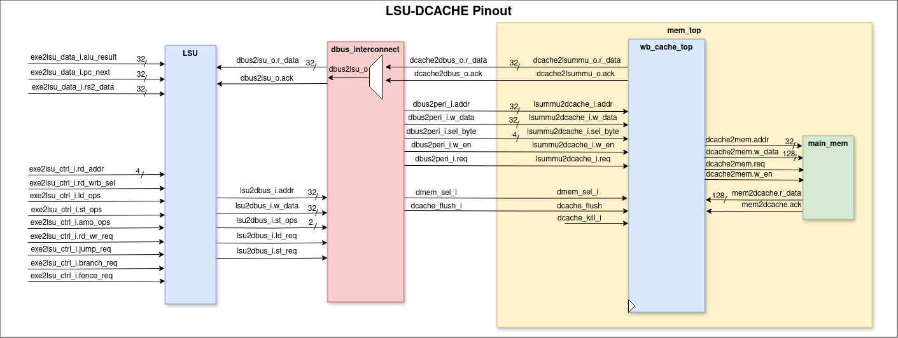
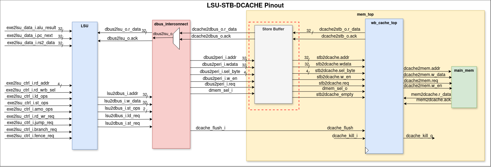

# Store-Buffer
A store buffer is a temporary storage area that holds data being written to memory. Its primary role is to improve performance by allowing the CPU to continue executing instructions while the write operation to memory is being completed.

## Enhancements in UETRV_Pcore
We are implementing a store buffer in the UETRV_Pcore to improve memory write latency. This store buffer will be inserted between the load/store unit (LSU) and the data cache (dcache), allowing the system to decouple memory write operations from the execution of instructions. By doing so, we aim to enhance overall performance by reducing the time the CPU spends waiting for memory writes to complete.

## Key Functions and Benefits of Store Buffers
- Store buffers allow the CPU to decouple the execution of instructions from the actual writing of data to memory. This means the CPU can continue processing while the memory system handles the write operation.
- Memory writes can be slow due to various factors like bus contention or memory access times. By using a store buffer, the CPU doesn't have to wait for these writes to complete, reducing the overall latency of instruction execution.

## Operation
When a store instruction is executed:
- The data is first written to the store buffer.
- The CPU continues with subsequent instructions without waiting for the data to be written to main memory.
- The store buffer eventually writes the data to memory, when it have data or not empty.

## Pinout Diagrams

Pinout of LSU and Dcache in UETRV-Pcore.

Pinout of LSU, Store Buffer and Dcache in UETRV-Pcore

